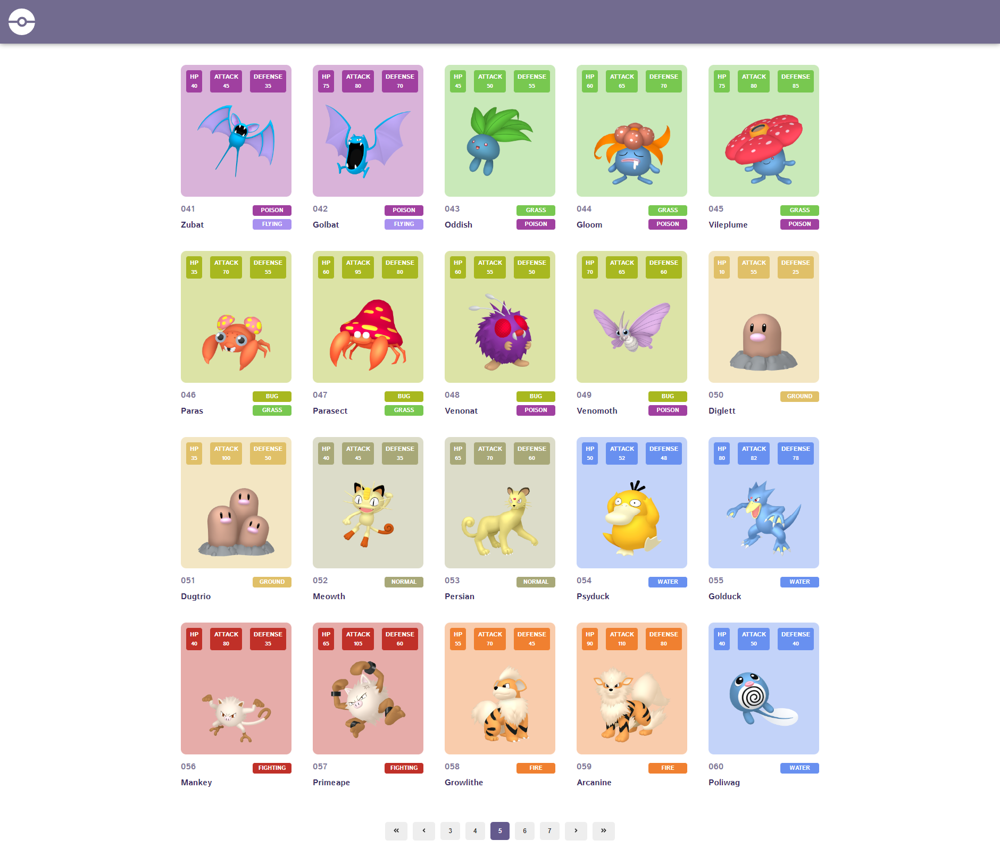

# Desafio Oi - Front-end

## Preview do desafio



[Link para a pagina](https://desafio-oi.vercel.app)

### Instruções para instalação do projeto:

Este projeto foi inicializado com [Create React App](https://github.com/facebook/create-react-app).

Acesse a pasta do desafio, execute o comando:

```
$ yarn
```

OU

```
npm install
```

### Docker

Para levantar a aplicação via Docker, execute o comando:

```
$ docker-compose build
```

### Rodando o projeto

```
$ npm run start
```

OU

```
$ yarn start
```

### Rodando o projeto com o docker

```
$ npm run start:container
```

OU

```
$ yarn start:container
```
